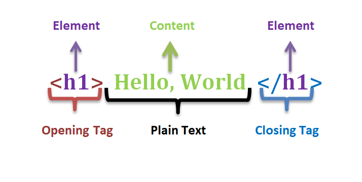
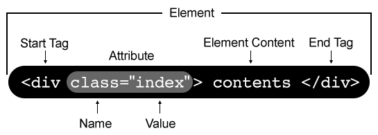
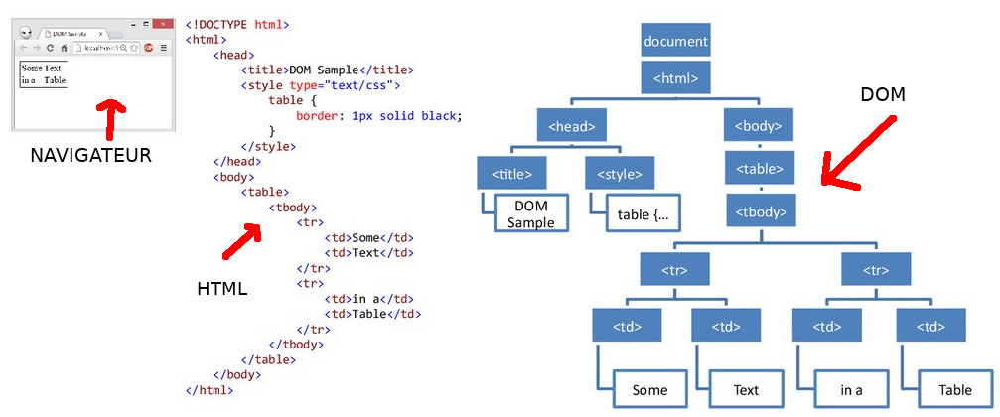
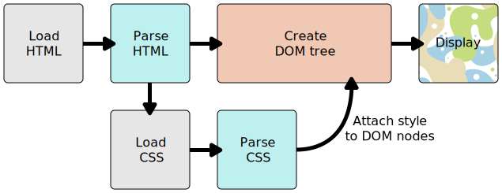
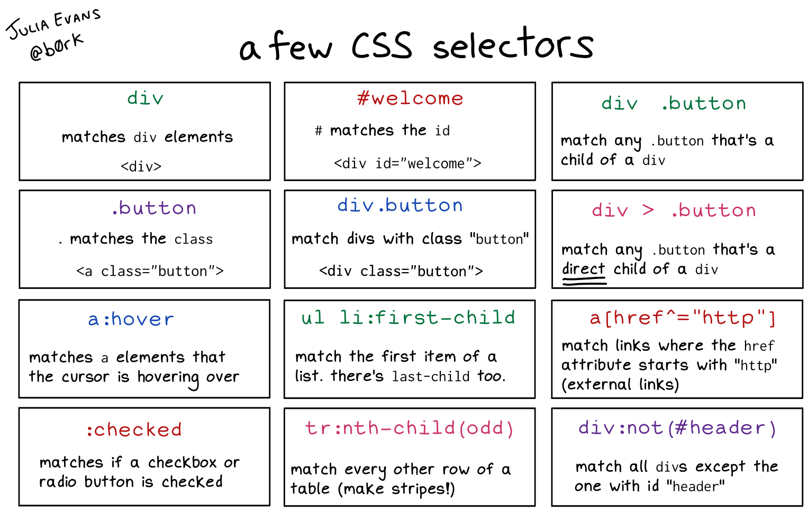
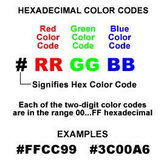

# Frontend Web Development

Quentin Richaud

qrichaud.pro@gmail.com

---

# In order to see this presentation and code example

You can check the instructions in the root folder `README.md`. You can 
run the `run.sh` script which will launch a simple python web server, serving
all the files present in this folder, and allowing you to display the webpage
examples, with all assets (CSS, images, fonts) being correctly loaded.

You need to have Python installed, and it uses the module SimpleHTTPServer
which is normally included by default in python.

---

# HTML and CSS

## How to build static web pages

---

# Assignment and course organisation

- This week : course about HTML and CSS, how to integrate a simple mockup
- Next week : HTML forms & native validation, introduction to CSS preprocessors

Assignment :

- This week : begin to integrate a mockup (without form) using HTML+CSS
- Next week : enhance your webpage integration with a form (new mockup provided), and refactor your stylesheet with SCSS

---

# Content vs formatting

## HTML

is a markup language, used to describe the **content** of a web page

## CSS

is a style sheet language, used to apply formating to the elements of an HTML document

---

# Preview of an HTML document

```html
<!DOCTYPE html>
<html>
  <head>
    <meta charset="utf-8">
    <title></title>
    <link href="style.css" rel="stylesheet" />
  </head>

  <body>
    <h1>Mines Saint Étienne</h1>
    <div class="main-navigation-banner">
      <div class="school-logo-container">
        
      </div>
      <div class="main-navigation">
        <a href="./lecole" class="navigation-item active">ÉCOLE</a>
        <a href="./formation" class="navigation-item">FORMATION</a>
        <a href="./recherche" class="navigation-item">RECHERCHE</a>
      </div>
    </div>
  </body>
</html>
```

---

# A few things from this example 

- HTML is almost a subset of XML.

- It is made of tags elements (e.g `<h1>Mines Saint Étienne</h1>`).

- Tags elements can inserted into others, making the document into a tree structure

---

# Preview of a CSS document

```css
.main-navigation-banner {
  display: flex;
  background-color: #f5f5f5;
  font-family: Helvetica Neue,Helvetica,Arial,sans-serif; 
  font-size: 14px;
}

.main-navigation-banner .school-logo-container .school-logo {
  width: 130px;
}

.main-navigation-banner .main-navigation .navigation-item {
  color: #333333;
}

.main-navigation-banner .main-navigation .navigation-item .active {
  color: #61259e;
}
```

A CSS document is a list of rules, that apply to the HTML document content. Each rule specifies which element it applies to,
and what kind of style to apply to this element.

---

# The rendered web page


The previous examples are inspired from a web page of the EMSE website. It represents only a subset of the page. 

---

# Anatomy of an HTML element

```html
<a href="./lecole" class="navigation-item active">ÉCOLE</a>
```
- `<a href="./lecole" class="navigation-item active">` is the opening tag of the element
- `a` is the tag name
- `href` and `class` are tag attributes
- `"./lecole"` is the value for the attribute `href`, `"navigation-item active"` is the value of the attribute `class`
- `ÉCOLE` is the text content of the element. We could also put other HTML elements inside this element.
- `</a>` is the closing tag of the element.

---
# Anatomy of an HTML element



---
# Anatomy of an HTML element



---

# Self-closing tags

A few HTML elements don't take a text content. Therefore, instead of having a opening tag and a closing tag, they are self closing.

Example : the `hr` element represents an horizontal separator line.

```
<hr/>
```

The syntax without an ending `/` is also accepted but can be confusing.

Another example : the image tag. It takes the URL of the image to display as a value of the attribute `src`, thus it needs
no content.

```


```

---

# A few common HTML elements

- `h1`, `h2`, `h3`, ... : Titles (and ranked subtitles)
- `p` : paragraph
- `a` : anchor, that is an hyperlink, in order to navigate to another web page
- `ul` : unordered list (bullet point)
- `ol` : ordered list (numbers)
- `li` : list element (only valid inside a `ul` or `ol` element)
- `div` and `span` : generic container elements, used to structure the document and the formatting

## And self closing elements

- `img` : insert an image
- `hr` : horizontal line separator
- `br` : line break


---

# Difference between block and inline elements

## Block elements

- Each block element appear on a new line.
- By default, block elements use the whole width of their parent
- You can't nest a block element inside an inline element, but you can nest block elements in one another

## Inline elements

- Inline elements behave like text, there is no new line between inline elements.


---

# Difference between block and inline elements


---

# Example of block elements

`div`, `h1`, `p`


---

# Example of inline elements

`span`, `a`, `img`

See `./demo_code/example2.html`

---

# HTML elements to DOM

After you have writen an HTML document, with nested elements, the Web Browser parses it and builds the **Document Object Model**, a.k.a. the **DOM**.

It's interesting to differentiate the DOM from the HTML document, because later we will see that we can modify the DOM after the page has loaded (with
javascript),
and thus the DOM doesn't always equate the original HTML document.




---

# Inspecting the DOM (debugging)

Web browsers provide you developper tools, that allow you to inspect a loaded webpage and browse the DOM, visualize each DOM element and its property easily.

For example, the Chrome Developper Tools (in Chrome web browser), that you can open with `Control + Shift + J` or `Command + Option + J` (Mac). 

Go to the `Elements` tab to browse the DOM.

---

# `<body>` vs. `<head>` element

The basic HTML document template looks like this

```html
<!DOCTYPE html>
<html>
  <head>
  </head>

  <body>
  </body>
</html>
```

The earlier examples did not respect this template, for the sake of simplicity while presenting the basic HTML elements. However they are 
not valid HTML document. (Note that web browsers are permissive and will handle bad formatted HTML document nevertheless).

The HTML content that would be displayed go into the `<body>` element.

The `<head>` element is mandatory and will contain metadata (not displayed but still used by the browsers). 

---

# The `<head>` element

Example of metadata you will have in the head :

- Web page title (displayed in the OS native window title bar, or in the web browser navigation bars)
- Links to external resources the browser needs to load, such as CSS stylesheets
- Encoding 
- SEO data for search engines
- Preview data for social media websites

---

# Example of a `<head>` element

```html
  <head>
    <meta charset="utf-8">
    <title>My Webpage</title>
    <link href="style.css" rel="stylesheet"/>
  </head>
```

---

# Adding styling to our document

(Because right now it's ugly).

We need to write CSS rules in a separate document : the CSS stylesheet (which will be a `.css` file).

Note : there are other solution to add CSS rules, but they are bad practice so I won't teach you them.

Let's see example n° 4, in which I added this CSS document :

`style.css`

```css
h1 {
  color: red;
}
```

And this line in the `<head>` of the HTML document

```html
  <link href="style.css" rel="stylesheet" />
```

---

# What the web browser is doing



---

# Anatomy of a CSS rule


---

# Different kind of selectors



---

# Focus on selectors

- Beware to not make a rule too "wide", you take the risk to have CSS rules applying to other
  elements in you webpage that you didn't intend to. My way to to this, is to always restrict
  the selector by putting the chain of expected parents. I.e, instead of `.menu-item`, I'm going
  to write `.top-container .nav-menu .menu-item`. Excepted if I explicitly want to select all
  `.menu-item` in my documents.
- `.class1.class2` selector, selecting an element that have the two classes. Useful for specializing
  an element. You will see it in the demo with `.menu-item.active`.
- pseudo selectors : selecting an element in a particular interaction state, for example 
  `.menu-link:hover`

---

# A few common CSS rules

## Coloring

- Text color : `color: red;`
- Background color : `background-color: red`
- Border color : `border-color: red`

There are several ways to define the value for a color in CSS : default color names,
hexadecimal code, rgb code. I personnally favor hexadecimal code :



---

# A few common CSS rules

## Text styling

- Text size : `font-size: 14px`. Sizes can be in several units (applies to all kind
  of size related properties). Check online documentation for more details.
- Text weight (boldness) : `font-weight: 400`
- Font : `font-family: 'Open Sans'`

---

# A few common CSS rules

## Height, width

- Height of the element : `height: 20px`
- Width of the element : `width: 40px`

Beware, there are many "states" of the elements that modify the behaviour for width and height,
and can nullify the value you put to these properties.

One example is the case of `inline` elements (either by default, such as `<span>`, or set
as inline with the CSS property `display: inline`), for which you cannot set a height or 
width.

---

# A few common CSS rules

## margins, padding

Here is the box model of CSS :


The properties to adjust margin or padding :

- `padding: 5px` (sets padding for all sides)
- `margin: 5px` (sets margin for all sides)
- `padding-top: 5px` (sets padding for a specific side)
- `margin-top: 5px` (sets margin for a specific side)


---

# Positionning in CSS

Positionning and arranging elements in CSS is a mess. This is due to 2 factors :

- The age of the language, it was conceived in the 1990s', at a time when the purpose 
  of a webpage was vastly different than today
- The necessity to be always backward compatible, (in order to not break existing webpages). 
  So each revision of CSS adds new functionnalities, new ways to arrange elements, while maintaining
  the old ones. So every methods coexists, which leads to a huge mess.

As a consequence, there are a lot of different ways to position elements. The most important thing to
do is to be consistent. If you choose a method of positionning, stick to that one in all your page.

---

# Positionning in CSS

Vertical arrangement of elements is easy, because that's what the early CSS design had in mind.
But once you need to play with horizontal elements it becomes complicated. Here is a list of 
methods that you can encounter for horizontal arranging of elements :

- Using `display: table`. Very old way to do. **DO NOT USE THIS ONE**, it was a trend in the 1990s,
  a very bad idea today. `display: table` is meant to do tables, not layouts.
- Using `display: inline-block` or `float: left`. **I do not recommend these**. This was the way
  to do in the 2000s, earle 2010s. It's messy and uncesseray complicated in my opinion. You will
  still see many webpages implemented with this method. For example the EMSE website.
- Using Flexbox (`display: flex`) : a new feature introduced arround 2010, and used since the 
  mid 2010s. This feature was introduced to solve many positionning problems, and is supported
  by enough browsers that this is the one I recommend (and I'm going to teach you).
- Using CSS Gris (`display: grid`) : this is an even better solution than Flexbox to layouting
  problems. However its adoption rate is still a bit too low (see <https://caniuse.com/?search=css%20grid>). I expect it to become the best method by the mid 2020s'.

---

# Flexbox

See https://css-tricks.com/snippets/css/a-guide-to-flexbox/

---

# Semantic HTML elements

As a note (because I'm not going to use them in the demo), HTML also has "semantic" 
block elements, such as : `<section>`, `<header>`, `<footer>`, `<navigation>`.

They behave like a `<div>`, but provide semantic data to the browser and search engine.

For example : `<header>` tells that this block element is meant to be a header in the webpage.

---

# Example of a HTML and CSS integration

From a mockup provided by a graphic designer.

---

# Example of a HTML and CSS integration

  Look at the folder `demo_code/mines_lecole_mockup`, at the root of the folder
  you have the "mockup" files (that would be the kind of files provided to you by the
  graphic designer). One is annotated with elements such as layout sizes, text sizes and
  colors (note : not everything is given, you often have to guess some elements).

  I also annotated one with all the containers I am going to use for my integration.

  The different steps of the implementation are in folders `./step1`, `./step2`, etc.

  The final integration is in the folder `./integration`.

  You need to have a web server running, serving the files. 

---


# Example of a HTML and CSS integration

- Identify the assets and information you need (images, fonts, colors, sizes, margins, …)
- Identify how you are going to organize your HTML with containers (mostly blocks), how they
  are going to be organized, horizontally and vertically


---

# Example of a HTML and CSS integration

Step 1 : Integration of the HTML, without style for now.

Give at least one class to every container, with a logical semantical name (this is the
same as naming variables in a program).

Use several classes when needed (for example `active` for the `menu-item` container of 
the current page) 

Siblings element from a semantical point of view must have the same class name
(think that the HTML might be dynamically generated)

---

# Example of a HTML and CSS integration

Step 2 : Demonstration of block positionning with the block `page-content`

1. The easy case of centering a block of fixed width inside its parent container. We want
   to center the block `page-content`, with a fixed width of 1140px.
2. How to arrange the children (`left-panel` and `right-panel`) horizontally instead of vertically,
   using flexbox.
3. Setting width and margins for `left-panel` and `right-panel`.

Note : I put temporary flashy background colors as a mean to easily show you the blocks

---

# Example of a HTML and CSS integration

Step 3 : Finishing the `page-content` section

- Adjusting title style : font-size, font-weight and removing default margins
- Adjust line-spacing for the main text
- For the secondary menu on the left : adjust margins, text color, and horizontal
  delimiter default styling

---

# Example of a HTML and CSS integration

Step 4 : A more complicated case of horizontal element arranging, the top header

I need the middle section (logo + menu) to be 1140px width and centered, but I also need
to have control on the blank area on the left and right (contrary to `page-content`).

I'm going to solve this by using flexbox, and property `flex-grow` on the children elements.

For the demonstration, I remove the content of `top-header-content`, leaving only the 
top level children `top-header`.

`top-header` is a flex container with 3 children :

- `left-placeholder` : takes all the width remaining in its parent, sharing it with its siblings
  with a ratio of 1.
- `top-header-content` : has a fixed width of 1140px, leaves the rest of the width of the parent
  for its siblings.
- `right-placeholder` : takes all the available width of the parent, sharing it with its siblings
  with a ratio of 1.

---

# Example of a HTML and CSS integration

Step 5 : Flexbox in flexbox

In the container `top-header-content`, I once again need to arrange horizontally the elements.
Even though this element is a flex children of its parent `top-header`, I'm also going to make 
it a flex container for its own children.

So, in relation to its parent (`top-header`), `top-header-content` is a flex item. But in relation
to its children, it is a flex container.

It has 2 children : 

- `logo` : has a fixed width of 190px
- `nav-menu` : takes the remaining width

---

# Example of a HTML and CSS integration

Step 6 : Once again flexbox in flexbox

I'm going to put  `nav-menu` as a flexbox container, in order to easily align its children
(the `nav-menu-item` elements) horizontally.

I'm also going to use the flexbox properties `justify-content` and `align-items` to 
adjust the children positionning to my needs.

I then put all the final touches : 

- colors
- change of formatting when hovering a menu item
- different formatting for the active menu item
- bottom padding

---


# External resources 

HTML Basics (from MDN : Mozilla Developper Network) : https://developer.mozilla.org/en-US/docs/Learn/Getting_started_with_the_web/HTML_basics

CSS Basics (from MDN) : https://developer.mozilla.org/en-US/docs/Learn/Getting_started_with_the_web/CSS_basics

More comprehensive MDN Web Development course : https://developer.mozilla.org/en-US/docs/Learn

W3Schools : https://www.w3schools.com/css/css_syntax.asp and https://www.w3schools.com/html/default.asp

Positionning elements with flexbox : https://css-tricks.com/snippets/css/a-guide-to-flexbox/ 

---

# External resources 

Any resource you find yourself online ! Web development is constantly evolving and self-learning is a vital skill.

For example if you want to use : CSS Grid, or arranging elements with the `float: left` method, search online how these work. 

If you stumble on a CSS rule you do not understand, do the same.

---

# Assignment

The assignment is in folder `./1_HTML/assignment`.

You will find all instructions in the file `instructions.md`